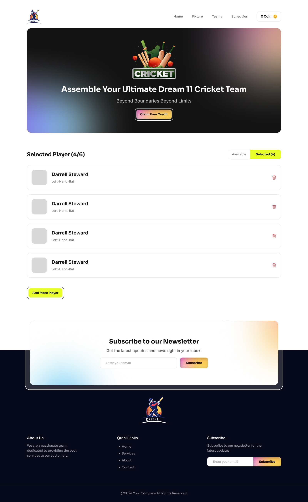

# **Six & Out - Cricket Hub** 🏏
- Welcome to Six & Out, your all-in-one cricket hub! Whether you’re building your dream team, analyzing player stats, or bidding on new talent, Six & Out is the ultimate platform for cricket enthusiasts to dive into every aspect of the sport.

 # **Project Overview**🚀
- Six & Out is a comprehensive cricket hub designed to bring cricket fans closer to the game. From player selection to match insights, Six & Out delivers an interactive experience for users to explore and manage a virtual cricket ecosystem.

 # **Technologies Used**💻
- *React* - For building a dynamic and responsive user interface.
*JavaScript (ES6+)* - Core programming language used throughout the project.
*React Toastify* - For easy-to-use notifications and alerts.
*CSS (Tailwind CSS)* - For styling and creating a mobile-responsive design.
 # **Key Features** 🌟
- Player Selection & Management
Users can create a personalized team by selecting from an extensive player database. The system also provides budget management, ensuring users stay within their virtual balance while bidding on new players.

# **In-App Notifications**
- With React Toastify, real-time notifications inform users of successful player additions, errors, and balance updates, creating a seamless experience.

# **Dynamic Coin Management**
- Track and manage your virtual currency in real-time, adding or deducting credits based on player bidding and selection activities.

**live** 
(https://loquacious-lamington-52d257.netlify.app/)

# Design
Page with Available Players

Page with Selected Players

